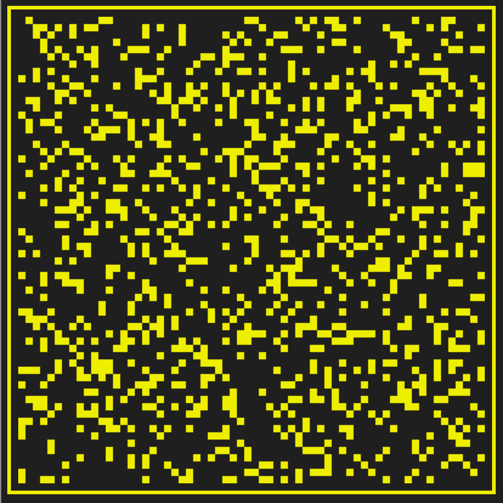

Visualize
=========

This repository shows a very simple algorithm of selecting nodes evenly over a 
distributed set.

It also shows the following:

 * Pure functional programming in JavaScript with the DOM and canvas.
 * Monadic IO.
 * Logging using the Writer monad.
 * Immutable heuristics to reduce full scans.

## Improvements:

 * Looking into generational spaces. Consider GC algorithms for available nodes.

## Contributions:

If you can improve this, drop me an email, we might have job for you!

## Screenshot

